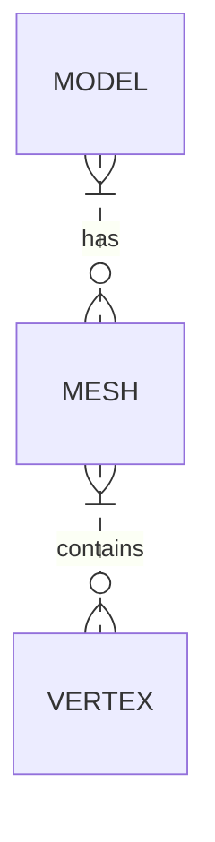

# Dokumentace k programu

## Modely, vertexy a meshe
Proces nahrávání modelů se skládá z:
- Načtení souboru pomocí `LOADER`u do pomocné struktury
- Vytvoření `MESH`ů, textur atd...
- Finální zakomponování do struktury `MODEL`u

